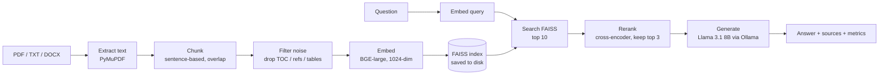

# Ember

Ember is a retrieval-augmented generation (RAG) system I built from scratch to learn how the whole pipeline actually works, without hiding the moving parts behind a framework. You point it at your own PDFs, ask questions in plain language, and get answers that are grounded in the document, with the source passages shown and a few quality numbers for every answer.

It all runs on your own machine. The embeddings, the vector search, the reranking, and the language model are local. There are no API keys and nothing is sent to the cloud.

## What it does

- Reads PDFs (also plain text and Word files) and answers questions about them.
- Streams the answer as it's written, and shows the passages it pulled the answer from.
- Reports quality numbers per answer: how relevant the answer is, how close the retrieved chunks were, a rough hallucination check, and timings.
- Lets you add and remove documents from the page. Only the file you changed gets re-embedded, so it stays quick.
- Ships with an evaluation script so you can measure retrieval quality on a question set instead of guessing.

## Before you start

You need two things on your machine:

1. **Python 3.10 or newer.**
2. **Ollama**, which runs the language model locally. Install it from [ollama.ai](https://ollama.ai), then pull the model Ember uses:

   ```bash
   ollama pull llama3.1:8b
   ```

   Keep Ollama running in the background. Installing it normally sets that up for you; you can confirm it's up with `ollama list`.

## Setup

```bash
# 1. Get the code
git clone https://github.com/pandeyAnush/ember.git
cd ember

# 2. Create a virtual environment and install dependencies
python -m venv venv
venv/bin/pip install -r requirements.txt
```

The install pulls in PyTorch and sentence-transformers, so it takes a few minutes. The first time you run Ember it also downloads the embedding and reranker models (roughly 1.5 GB, once). After that first download it works offline.

## Running it

```bash
./run.sh
```

Now open **http://127.0.0.1:5050** in your browser, upload a PDF from the panel on the right, and start asking questions.

A couple of notes on `run.sh`:

- It kills whatever is already on port 5050 before starting, so restarting Ember never throws an "address already in use" error.
- The project uses port 5050 because macOS quietly runs AirPlay on 5000.
- Keep the terminal open while you use the app. That terminal is the server; closing it stops Ember.

## Using it

- Type a question and send it. The answer streams in, and a "Retrieved Context" panel shows the passages it used and how well each one matched.
- To add a document, click the upload area. The new file is embedded and added to the index; the documents you already have are left untouched.
- The Documents panel lists everything indexed, with a delete button per file and a clear-all.
- Specific questions work much better than broad ones. "What tools are used in the pipeline?" retrieves far better than "tell me everything about this," because retrieval matches a question against passages, and a vague question doesn't match anything in particular.

## How it works



Each stage earns its place:

| Stage | What happens | How |
|---|---|---|
| Extract | PDF becomes text | PyMuPDF, with PyPDF2 as a fallback |
| Chunk | Text is split into ~512-character passages that overlap, so a fact spanning a boundary stays intact | `SentenceChunker` |
| Filter | Dot-leader table-of-contents lines, reference lists, and number tables are dropped. They look similar to questions but hold no answers | `_is_useful_chunk` |
| Embed | Each passage becomes a 1024-dimensional vector | `BAAI/bge-large-en-v1.5` |
| Index | Vectors go into a FAISS index that's saved to disk, so a restart doesn't re-embed everything | FAISS `IndexFlatL2` |
| Retrieve | The top 10 passages by similarity (the query gets BGE's query-instruction prefix) | |
| Rerank | A cross-encoder re-scores those 10 by reading the query and passage together, and the best 3 are kept | `cross-encoder/ms-marco-MiniLM-L-12-v2` |
| Generate | The model answers using only the retrieved passages, streamed as it writes | `llama3.1:8b` via Ollama |
| Evaluate | Relevance (question-to-answer cosine), a heuristic hallucination check, and timings | |

## Checking retrieval quality

The whole point of the project was to make retrieval quality something you can measure, not just eyeball. The evaluation script scores the running system against a set of questions:

```bash
venv/bin/python evaluate.py
```

It prints, per question and overall: keyword recall (did the answer contain the facts you expected), answer relevance, retrieval similarity, hallucination flags, and latency. Edit `eval_questions.json` to match whatever document you've loaded.

A sample run on a 66-page MLOps report with the default chunk size of 512:

```
Answer keyword recall : 85%
Answer relevance      : 75%
Retrieval similarity  : 60%
Hallucinations flagged: 0/8
Avg latency           : 12.5s
```

Chunk size is adjustable, so you can measure the usual trade-off yourself:

```bash
RAGLAB_CHUNK_SIZE=256 ./run.sh   # then run evaluate.py again
```

| Chunk size | Chunks | Recall | Relevance | Latency |
|---|---|---|---|---|
| 512 (default) | 119 | 85% | 75% | 12.5s |
| 256 | 250 | 85% | 69% | 6.3s |

Smaller chunks are faster and more precise; larger ones give richer answers but run slower. Recall held steady here because both sizes found the key facts.

## Configuration

| Variable | Default | What it's for |
|---|---|---|
| `RAGLAB_CHUNK_SIZE` | `512` | Target chunk size in characters, for indexing experiments |
| `OLLAMA_HOST` | `http://localhost:11434` | Where Ollama is, in case you run it elsewhere |

## Project layout

```
ember/
├── run.sh                     # start the backend (frees port 5050 first)
├── evaluate.py                # evaluation harness
├── eval_questions.json        # questions used for evaluation
├── requirements.txt
├── frontend/
│   ├── raglab_ui.html         # the web UI (served by the backend at /)
│   └── vendor/                # React, Babel, Tailwind, kept local instead of a CDN
└── rag/
    ├── backend_server_production.py   # Flask app: serves the UI and API, handles indexing
    ├── document_loader.py             # PDF/TXT/DOCX to text
    ├── chunking.py                    # sentence chunking with overlap
    ├── embeddings_production.py       # BGE embeddings
    ├── vector_store.py                # FAISS index and persistence
    ├── retriever.py                   # ties the chunker and store together
    ├── reranker.py                    # cross-encoder reranking
    ├── llm_generator_production.py    # Ollama generation (streaming)
    ├── rag_pipeline_production.py     # orchestration: retrieve, rerank, generate, evaluate
    └── evaluation.py                  # metrics logging
```

## Built with

BGE-large embeddings (`BAAI/bge-large-en-v1.5`), a `ms-marco-MiniLM-L-12-v2` cross-encoder for reranking, FAISS for the vector index, Llama 3.1 8B through Ollama for generation, Flask on the backend, and a React interface with Tailwind (both vendored locally so it works without a CDN).

## A few decisions worth explaining

- **Why rerank at all?** Vector similarity is fast but blunt. A cross-encoder reads the question and a candidate passage together, which gives a much sharper final order. After clean chunks, it was the single biggest lever on answer quality.
- **Why filter chunks?** On real PDFs, tables of contents and reference lists sit close to a question in vector space but answer nothing. Dropping them was the difference between noise and grounded answers.
- **Why save the index?** Embedding a large PDF is the slow step. The FAISS index and a small fingerprint of the source files are written to disk, so restarts are instant and only files that actually changed get re-embedded.
- **Why keep everything local?** It stays private and free, and I could inspect every stage. The goal was to understand the internals, not to call someone else's API.
