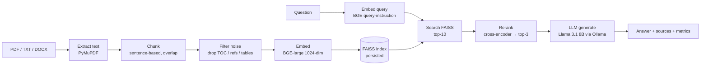

# 🔥 Ember

A **from-scratch, fully-local Retrieval-Augmented Generation system** — a private AI that reads your documents, built to understand every stage of a RAG pipeline by implementing it end to end, with no black-box framework in between.

Ask questions about your own PDFs and get grounded, streamed answers with source citations and live quality metrics. Everything runs on your machine: embeddings, vector search, reranking, and generation. **No API keys, no cloud.**

> 📖 **Want to understand — or rebuild — every piece?** See the complete [**Build Guide**](docs/BUILD_GUIDE.md): how RAG works from zero, every stage of this project explained with the code and the *why*, a step-by-step roadmap to build your own, and how to explain it to anyone.

```
┌──────────────────────────────────────────────────────────────┐
│  Your PDF  →  Chunk  →  Embed  →  FAISS  →  Rerank  →  LLM     │
│                                                     ↓          │
│                              grounded answer + sources + metrics
└──────────────────────────────────────────────────────────────┘
```

---

## Features

- 🔎 **Production retrieval pipeline** — BGE embeddings → FAISS similarity search → cross-encoder reranking → local LLM generation
- 🔒 **100% local** — Ollama for the LLM, sentence-transformers for embeddings; nothing leaves your machine
- ⏳ **Streaming answers** — sources appear instantly, the answer types out token-by-token
- 📄 **Real PDF handling** — PyMuPDF extraction with noise filtering (drops tables-of-contents, reference lists, and page junk that pollute retrieval)
- 📊 **Live quality metrics** — semantic relevance, retrieval similarity, hallucination check, timing — shown for every answer
- 📁 **Document management** — upload / delete from the UI; incremental indexing (only the changed file is re-embedded)
- 🧪 **Built-in evaluation harness** — score the system on a question set and run experiments (chunk size, etc.)
- 🌐 **One command, one URL** — `./run.sh`, then open `http://127.0.0.1:5050`

## How it works — the RAG pipeline



**Each stage, and why it's there:**

| Stage | What it does | Implementation |
|---|---|---|
| **Extract** | PDF → text | PyMuPDF (clean), PyPDF2 fallback |
| **Chunk** | Split into ~512-char passages with overlap so boundary-spanning facts stay whole | `SentenceChunker` |
| **Filter** | Drop dot-leader TOC lines, reference lists, number tables — they're topically similar to queries but carry no answers | `_is_useful_chunk` |
| **Embed** | Text → 1024-dim vectors | `BAAI/bge-large-en-v1.5` |
| **Index** | Fast similarity search, saved to disk (skips re-embedding on restart) | FAISS `IndexFlatL2` |
| **Retrieve** | Top-10 by vector similarity (query gets BGE's query-instruction prefix) | — |
| **Rerank** | Re-score the 10 with a cross-encoder, keep the best 3 — much sharper than raw similarity | `cross-encoder/ms-marco-MiniLM-L-12-v2` |
| **Generate** | Answer grounded **only** in the retrieved context, streamed token-by-token | `llama3.1:8b` via Ollama |
| **Evaluate** | Semantic relevance (question↔answer BGE cosine), heuristic hallucination check, timings | — |

## Quick start

**Prerequisites**
- Python 3.10+
- [Ollama](https://ollama.ai) running locally, with the model pulled:
  ```bash
  ollama pull llama3.1:8b
  ```

**Setup**
```bash
python -m venv venv
venv/bin/pip install -r requirements.txt
```

**Run**
```bash
./run.sh
```
Then open **http://127.0.0.1:5050**. Upload a PDF from the 📚 panel and start asking questions.

> `run.sh` frees port 5050 first (macOS AirPlay squats on port 5000, so this project uses 5050) and starts the backend. Leave the terminal open — that's your server.

## Using it

- **Ask a question** — type and send; the answer streams in with a "Retrieved Context" panel (sources + % match) and quality metrics.
- **Upload** — click the upload zone; the new file is embedded and added to the index (existing docs are *not* re-embedded).
- **Manage documents** — the 📚 panel lists indexed files with per-file delete and a clear-all.
- **Best results come from specific questions** — "What tools are used in the pipeline?" retrieves far better than "tell me everything." (RAG retrieves by relevance; broad summaries match nothing in particular.)

## Evaluation

The eval harness scores the running system on a question set — the project's whole point is making retrieval quality *measurable*.

```bash
venv/bin/python evaluate.py
```

It reports, per question and in aggregate: **keyword recall** (did the answer contain the expected facts), **semantic relevance**, **retrieval similarity**, **hallucination flags**, and **latency**. Edit `eval_questions.json` to match your document.

**Sample run** (on a 66-page MLOps report, chunk size 512):

```
  Answer keyword recall : 85%
  Answer relevance      : 75%
  Retrieval similarity  : 60%
  Hallucinations flagged: 0/8
  Avg latency           : 12.5s
```

### Run experiments

Chunk size is tunable, so you can measure the classic RAG trade-off yourself:

```bash
RAGLAB_CHUNK_SIZE=256 ./run.sh    # then re-run evaluate.py
```

| Chunk size | Chunks | Recall | Relevance | Latency |
|---|---|---|---|---|
| **512** (default) | 119 | 85% | **75%** | 12.5s |
| **256** | 250 | 85% | 69% | **6.3s** |

*Smaller chunks → faster and more precise; larger chunks → richer answers but slower. Same recall here — both find the key facts.*

## Configuration

| Env var | Default | Purpose |
|---|---|---|
| `RAGLAB_CHUNK_SIZE` | `512` | Target chunk size (chars) for indexing experiments |
| `OLLAMA_HOST` | `http://localhost:11434` | Ollama server URL (e.g. for containers) |

## Project structure

```
RAGLab/
├── run.sh                     # start the backend (frees port 5050 first)
├── evaluate.py                # evaluation harness
├── eval_questions.json        # question set for evaluation
├── requirements.txt
├── frontend/
│   ├── raglab_ui.html         # React UI (served by the backend at /)
│   └── vendor/                # React, Babel, Tailwind — vendored (no CDN)
└── rag/
    ├── backend_server_production.py  # Flask app: serves UI + API, indexing
    ├── document_loader.py     # PDF/TXT/DOCX → text (PyMuPDF)
    ├── chunking.py            # sentence chunking with overlap
    ├── embeddings_production.py  # BGE embeddings
    ├── vector_store.py        # FAISS index + persistence
    ├── retriever.py           # ties chunker + store together
    ├── reranker.py            # cross-encoder reranking
    ├── llm_generator_production.py  # Ollama generation (streaming)
    ├── rag_pipeline_production.py   # orchestration: retrieve→rerank→generate→eval
    └── evaluation.py          # metrics logging
```

## Tech stack

**Embeddings** BAAI/bge-large-en-v1.5 · **Reranker** ms-marco-MiniLM-L-12-v2 · **Vector store** FAISS · **LLM** Llama 3.1 8B (Ollama) · **Backend** Flask · **UI** React + Tailwind (vendored)

## Design notes

- **Why rerank?** Vector similarity is fast but coarse. A cross-encoder reads the query and each candidate *together*, giving a much sharper final ranking — the biggest single quality lever after clean chunks.
- **Why filter chunks?** On real PDFs, tables-of-contents and reference lists are semantically close to questions but answer nothing. Dropping them was the difference between garbage and grounded answers.
- **Why persist the index?** Embedding a large PDF is the expensive step. The FAISS index + a `data/` fingerprint are saved, so restarts are instant and only *changed* files are re-embedded.
- **Local-first** keeps it private, free, and fully inspectable — the point was to learn the internals, not to call an API.
